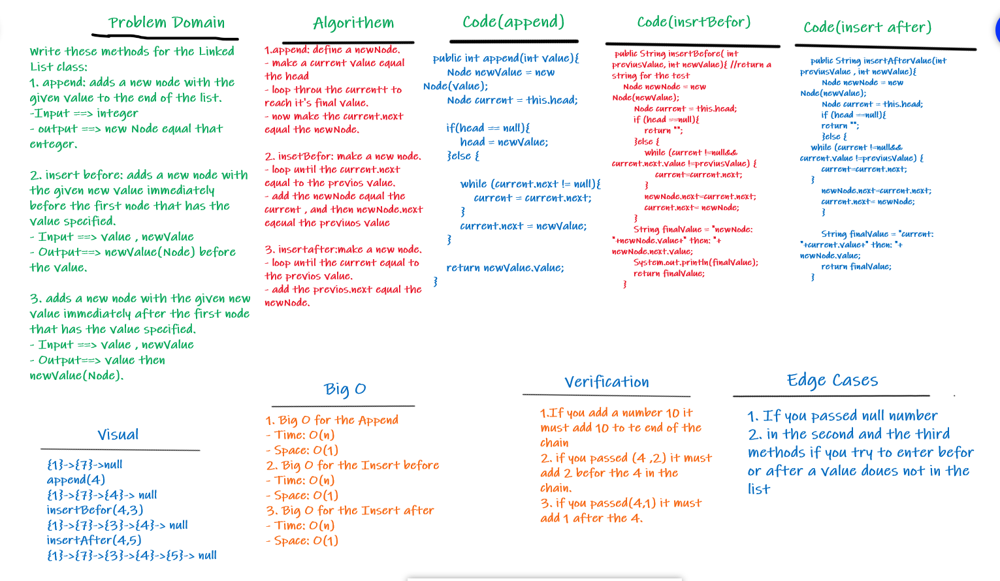

# Singly Linked List
**Linked List - A data structure that contains nodes that links/points to the next node in the list.**

## Challenge

**Creating a Linked List class contain the following methods:**

1. Append
- arguments: new value
- adds a new node with the given value to the end of the list.

2. Insert before
- arguments: value, new value
- adds a new node with the given new value immediately before the first node that has the value specified.

3. Insert after
- arguments: value, new value
- adds a new node with the given new value immediately after the first node that has the value specified.

## Approach & Efficiency
**1. Big O for the Append**
- Time: O(n)
- Space: O(1)

**2. Big O for the Insert before**
- Time: O(n)
- Space: O(1)

**3. Big O for the Insert after**
- Time: O(n)
- Space: O(1)

## API
1. Fourth one: Adds a new node with the given value to the end of the list.

2. Fifth one: Adds a new node with the given new value immediately before the first node that has the value specified.

3. Sixth one: Adds a new node with the given new value immediately after the first node that has the value specified.

## Whiteboard Process

## See my code
[code_Challenge06](src/main/java/codeChallenge05/LinkedList.java)