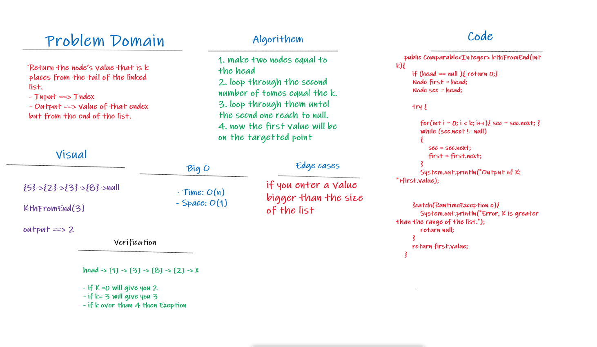

# Singly Linked List
**Linked List - A data structure that contains nodes that links/points to the next node in the list.**

## Challenge

**Creating a Linked List class contain the following method:**

> **kth from end**
- argument: a number, k, as a parameter.
- Return the node’s value that is k places from the tail of the linked list.
- You have access to the Node class and all the properties on the Linked List class as well as the methods created in previous challenges.

## Approach & Efficiency

**Big O for the kth from end**
- Time: O(n)
- Space: O(1)

## API
- Give us the node’s value that is k places from the tail of the linked list

## Whiteboard Process

## See my code
[code_Challenge07](src/main/java/codeChallenge05/LinkedList.java)