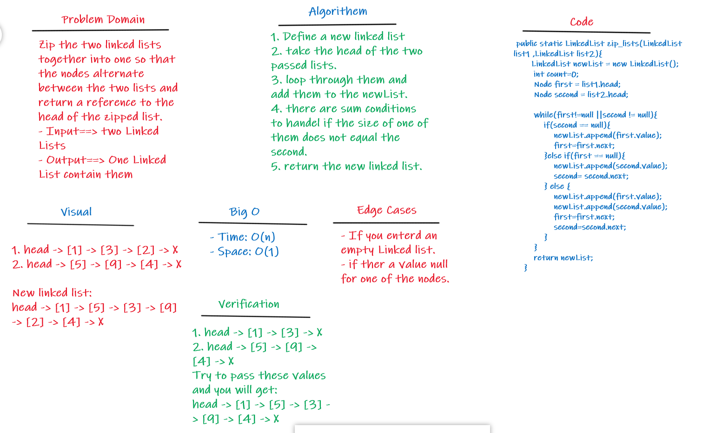

# Singly Linked List
**Linked List - A data structure that contains nodes that links/points to the next node in the list.**

## Challenge

**Creating a Linked List class contain the following method:**
> **zip_Lists**
- Arguments: 2 linked lists
- Return: Linked List
- Zip the two linked lists together into one so that the nodes alternate between the two lists and return a reference to the head of the zipped list.

## Approach & Efficiency
**Big O for the zipLists**
- Time: O(n)
- Space: O(1)

## API
- Zip a two linked lists together into one.

## Whiteboard Process
