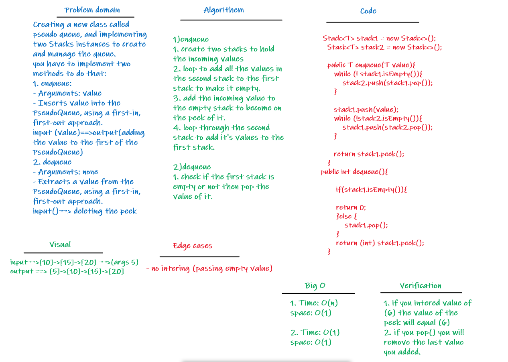

# Challenge Summary
<!-- Description of the challenge -->
- Creating a new class called pseudo queue. Internally, utilize 2 Stack instances to create and manage the queue.

## Whiteboard Process

## Approach & Efficiency

- **Big O for the enqueue**
- Time: O(n)
- Space: O(1)

- **Big O for the dequeue**
- Time: O(1)
- Space: O(1)

## Solution

- [The Code of the challenge](src/main/java/codeChallenge10/pseudoQueue.java)
- [The Test Code for the methods](src/test/java/codeChallenge10/AppTest.java)