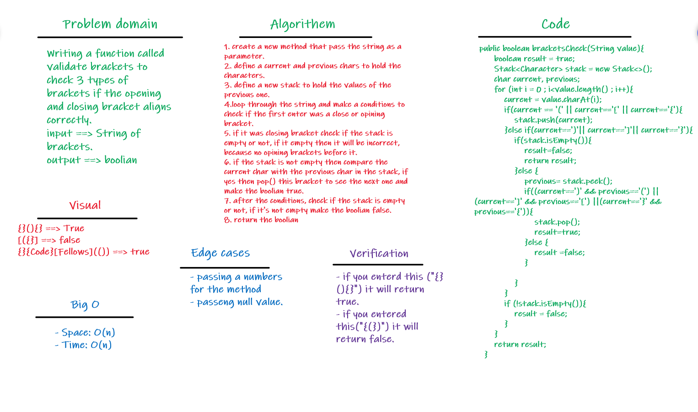

# Challenge Summary
- Writing a function called `validate brackets` to check 3 types of brackets if the opening and closing bracket aligns correctly:
- Round Brackets : `()`
- Square Brackets : `[]`
- Curly Brackets : `{}`

- > Arguments: string
- > Return: boolean

## Whiteboard Process

## Approach & Efficiency
- **Big O**
- Time: O(n)
- Space: O(n)

## Solution
- [Code for Validate Brackets](src/main/java/codeChallenge12/ValidateBrackets.java)
- [Test for Validate Brackets](src/test/java/codeChallenge12/AppTest.java)