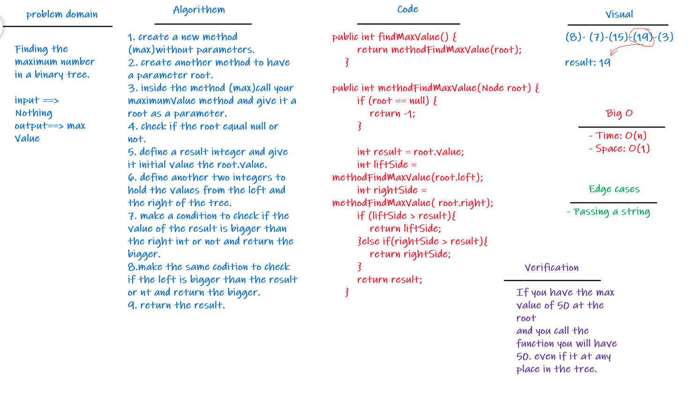

# Challenge Summary
>- **Writing a code to find the maximum value in a tree.**
- **The method of find maximum value**
- Arguments: none
- Returns: number (Maximum number in the tree).

## Whiteboard Process

## Approach & Efficiency
- **Big O**
- Time: O(n)
- Space: O(1)

## Solution
- [The code of Binary Search Tree](src/main/java/codeChallenge15/BinarySearchTree.java)
- [Test code for Binary Search Tree](src/test/java/codeChallenge15/AppTest.java)
