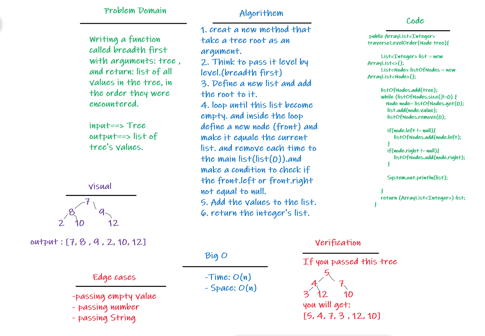

# Challenge Summary
* Writing a function called breadth first
- Arguments: tree
- Return: list of all values in the tree, in the order they were encountered

## Whiteboard Process

## Approach & Efficiency
- **Bid O**
- Time: O(n)
- Space: O(n)

## Solution
- [Code for my method](src/main/java/codeChallenge15/BinarySearchTree.java)
- [Test Code](src/test/java/codeChallenge15/AppTest.java)
