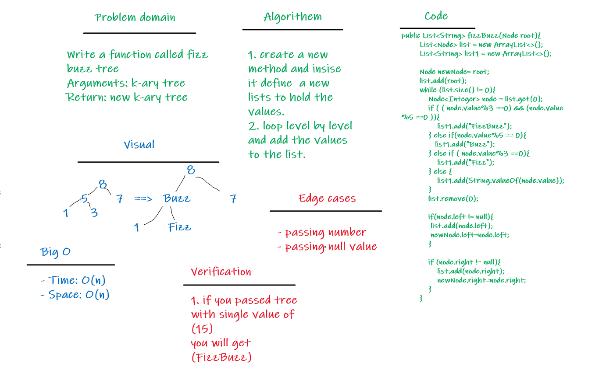

# Challenge Summary
> **Writing a function called fizz buzz tree**
- Arguments: k-ary tree
- Return: new k-ary tree

- If the value is divisible by 3, replace the value with “Fizz”
- If the value is divisible by 5, replace the value with “Buzz”
- If the value is divisible by 3 and 5, replace the value with “FizzBuzz”
- If the value is not divisible by 3 or 5, simply turn the number into a String.

## Whiteboard Process

## Approach & Efficiency
- **Big O**
- Time: O(n)
- Space: O(n)

## Solution
- [The code](src/main/java/codeChallenge18/fizzBuzz.java)
- [Test code](src/test/java/codeChallenge18/AppTest.java)
