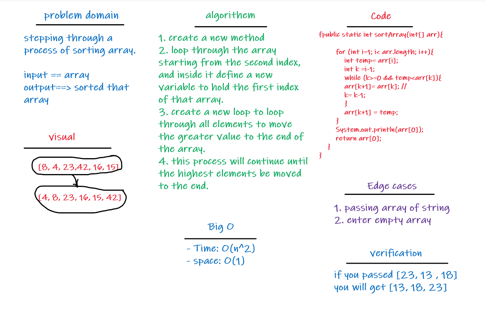

# Challenge Summary
- stepping through a process of sorting array.

## Whiteboard Process

## Approach & Efficiency
- **Big O**
- Time: O(n^2)
- space: O(1)

## Solution
- [This is my code](app\src\main\java\codeChallenge26\App.java)
- [This is my test code](app\src\test\java\codeChallenge26\AppTest.java)