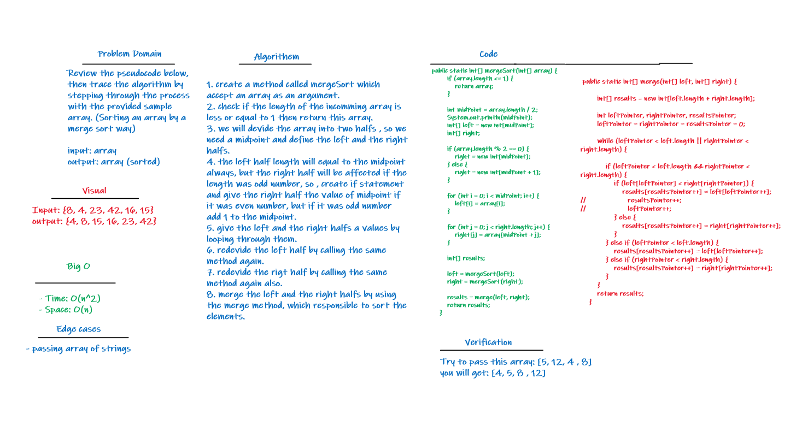

# Challenge Summary
Implementing the Merge Sort in a function that take an array as an arguments and return a sorted array.

## Whiteboard Process

## Approach & Efficiency
- **Big O**
- Time: O(n^2)
- Space: O(n)

## Solution

Table of contents | link 
--------------- | --------------- 
Merge Sort code | [Merge Sort code](app/src/main/java/codeChallenge27/MergSort.java)
Test Merge Sort code | [Test Merge Sort code](app/src/test/java/codeChallenge27/AppTest.java)
BLOG | [BLOG.md](BLOG.md)