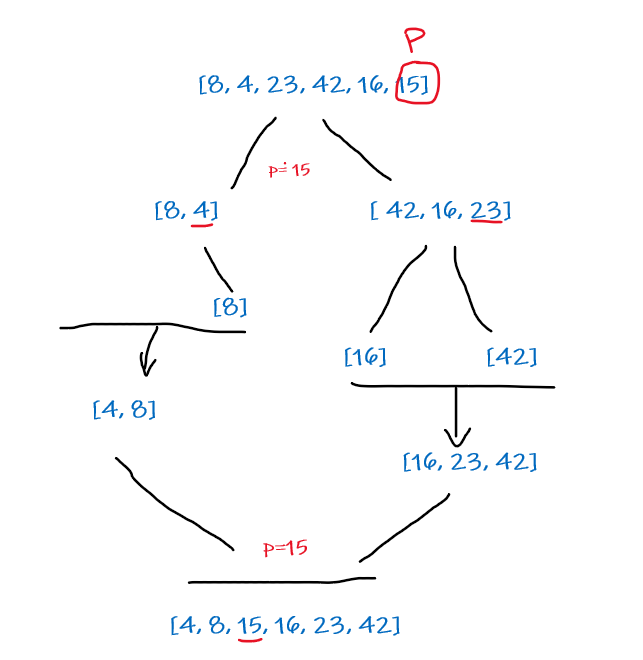

### *QuickSort:* is a Divide and Conquer algorithm. It picks an element as pivot and partitions the given array around the picked pivot.

 

* We have this array: [8,4,23,42,16,15]
* The pivot will be the last number it the array

    * The pivot will be in my case for the first time: (15)
    * The array will be devided into two halfs around the pivot.
        * The array will be arranged to be: [8, 4, *15*, 42, 16, 23]
        * Now the left side will be sorted in comparason with the pivot: [4, 8, 15, 42, 16, 23]

    * Now we will be having a new pivot equal: (23)
    * Again we will start compairing by this pivot
        * The array will be arranged to be: [8, 4, 15, 16, 42, 23]
        * Now the left side will be sorted in comparason with the pivot: [4, 8, 15, 16, 23, 42]

* **output: [4, 8, 15, 16, 23, 42]**
