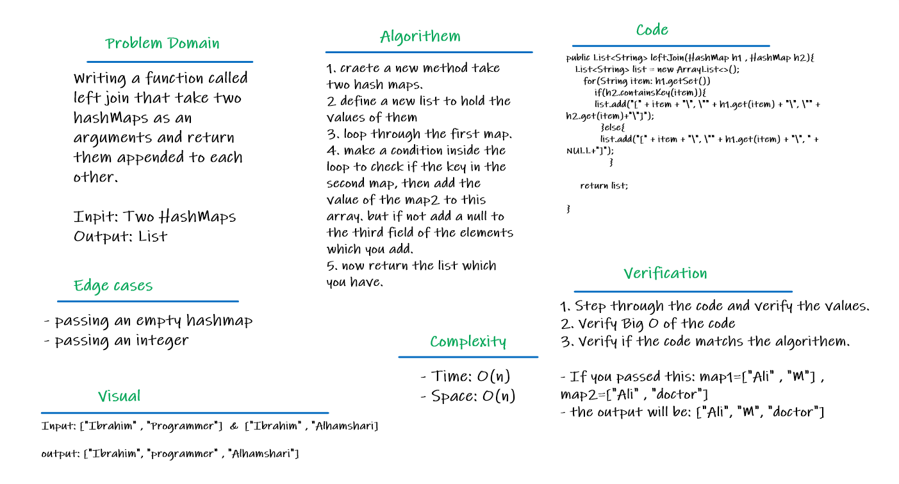

# Hashmap LEFT JOIN
- LEFT JOIN means all the values in the first hashmap are returned, and if values exist in the “right” hashmap, they are appended to the result row.
- If no values exist in the right hashmap, then it will be null in the result row at that field.

## Challenge
- Writing a function called left join
  - Arguments: two hash maps
  - The first parameter is a hashmap that has word strings as keys, and a synonym of the key as values.
  - The second parameter is a hashmap that has word strings as keys, and antonyms of the key as values.
  - Return: The returned data structure that holds the results is up to us. It should achieve the LEFT JOIN logic.

## White Board

## Approach & Efficiency
- **Big O**
  - Time: O(n) --> Because I have one loop in the code.
  - Space: O(n) --> Because I have a new list in the code.

## Solution
Solution | link
--------- | ----------
See the Code | [Left Join](app/src/main/java/codeChallenge30/LeftJoin.java)
See the test's Code | [Left Join test](app/src/test/java/codeChallenge30/AppTest.java)
