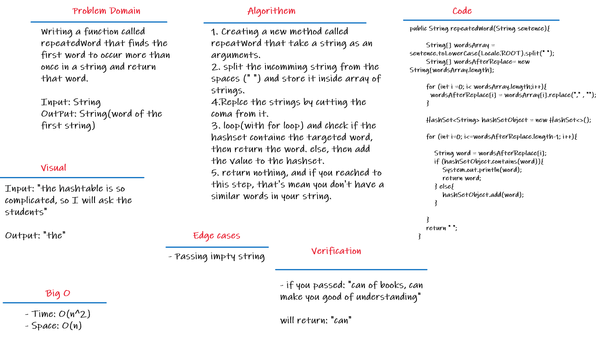

# Challenge Summary
- **repeatedWord**: This method finds the first word to occur more than once in a string.

- repeated word
    - Arguments: string
    - Return: string(word of the incomming string)

## Whiteboard Process

## Approach & Efficiency

- **Big O for repeatedWord**
    - Time: O(n)
    - Space: O(n)

## Solution
Table of contents | link 
--------------- | --------------- 
 RepeatWord Code | [HashTable Code, See the method (repeatedWord)](app/src/main/java/codeChallenge30/HashTable.java)
Test code | [Test code](app/src/test/java/codeChallenge30/AppTest.java) 