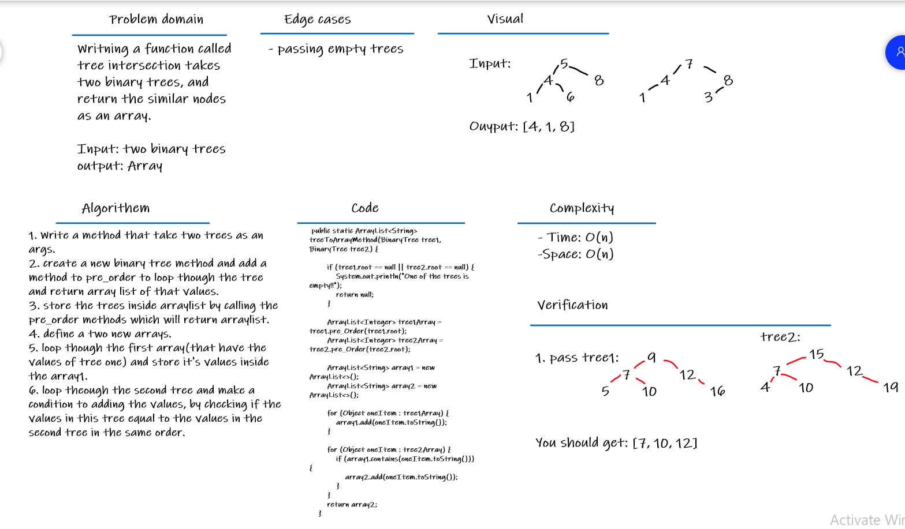

# Challenge Summary
- Writing a function called tree intersection
    - Arguments: two binary trees
    - Return: array

## Whiteboard Process

## Approach & Efficiency
- **Big O**
    - Time: O(n) ==> Because we have loops but not nested loops.
    - Space: O(n) ==> Because we have array, and it take O(n) space.

## Solution
Table of contents | link 
--------------- | --------------- 
 tree-intersection Code | [tree-intersection Code](app/src/main/java/codeChallenge30/App.java)
Test code | [Test code](app/src/test/java/codeChallenge30/AppTest.java) 