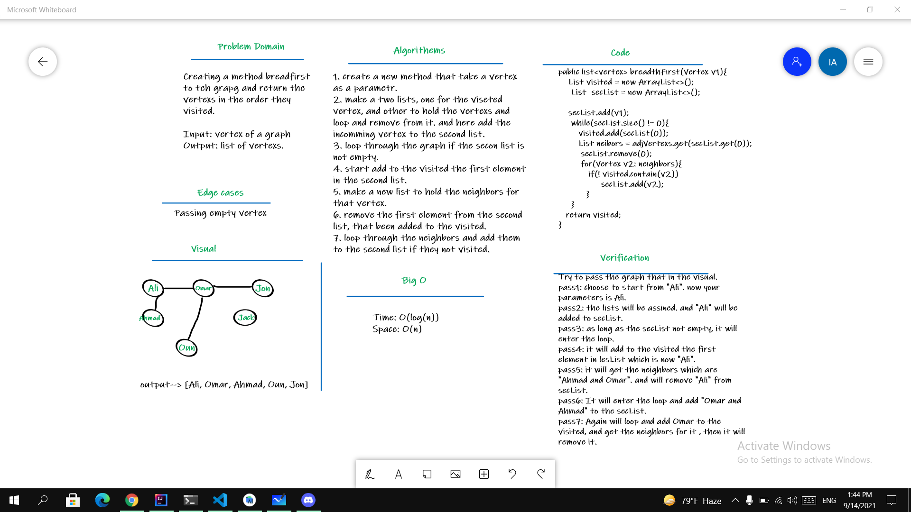

# Challenge Summary
- Writing a method "breadth first" for the Graph class:

   - Arguments: Node
   - Return: A collection of nodes in the order they were visited.
   - Display the collection

## Whiteboard Process

## Approach & Efficiency
- **Big O**
  - Time: O(log(n))-> Because if there are more vertexs, it will take more time.
  - Space: O(n) -> because I have Lists in my method.

## Solution
Table of contents | link
--------------- | ---------------
Breadth first code | [Breadth first code](app/src/main/java/codeChallenge35/Graph.java)
Breadth first Test | [Breadth first Test](app/src/test/java/codeChallenge35/AppTest.java)