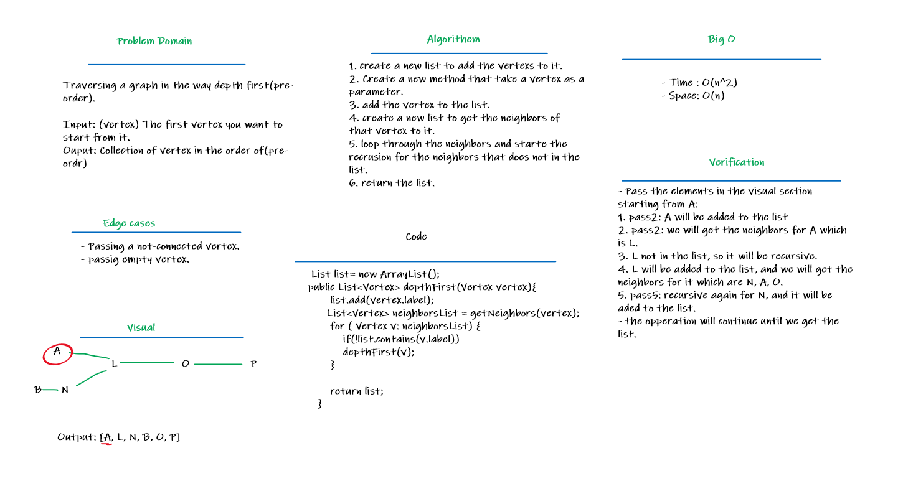

# Challenge Summary
- Traversing a graph in the way depth first(pre-order).
    - Arguments: Node (Starting point of search).
    - Return: A collection of nodes in their pre-order depth-first traversal order.
    - Display the collection.

## Whiteboard Process

## Approach & Efficiency
- Time : O(n^2) -> Because each time I make a recursion, and it dealt like the nested loop.
- Space: O(n) -> Because I have a new List 

## Solution
Table of contact | Link
---------------- | --------------
Depth First Cod | [Depth First](app/src/main/java/codeChallenge35/Graph.java)
Test Code | [Test](app/src/test/java/codeChallenge35/AppTest.java)